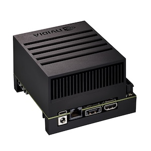

# Robot01

A customized Robosapien Agentic / LLM powered robot.
This is a hobby project on trying out ESP32 microcontrollers while at the same time looking at possibilities for hooking up (local) LLM's to control hardware via Agentic software (Langchain).

- **Hardware**
	- Robosapien V1 (replaced all electronics, including motor control)
	- Nvidia AGX Xavier 32GB (the brain)
	- Unexpected Maker Feather S3 ESP32 (Main board)
	- XIAO ESP32S3 Sense (camera/mic)
	- DFRobot MAX98357 (I2S Amplifier Module - 2.5W)
	- VL53L1X (Time of Flight Sensor)
	- BNO085 ( 9-DOF Orientation )
	- SSD_1306 - Led Screen (I2C)
	- Custom motor control board
		- MCP23017 ( input/output expander ) x 2
		- LD293D (Dual H-Bridge Motor Driver) x 4

Early development

- **ESP32 usage**  
	- Main : body movement, display, sensors and speaker (udp streaming).
	- Sense : the camera and mic (udp streaming).

- **Backend**
	Backend Implemented on a Nvidia AGX Xavier
	- Web interface & AI models
	- All models run locally (tts, stt, llm, agentic)
	- LLM : Ollama engine
		- LLM_MODEL: llama3.2 (can change)
		- AGENT_MODEL: llama3.2 (can change)
		- LLM_EXPRESSION_MODEL: gemma2:2b (can change)
		- VISION_MODEL: minicpm-v (can change)
	- Agentic: Langchain
	- TTS: speecht5_tts
	- STT: distil-large-v3, VAD: silero_vad  
	- Python based webserver (Flask) for Web interface and API

- **Frontend**
	- Simple HTML frontend based on PicoCSS and jQuery

Web interface.

## Intro

I am not a hardware guy, so the hardware is really a mess.
It just a bunch of sensors and other peripherals hooked up to two esp32 boards.
The programming started with Arduino but for performance issues I needed to do some RTOS task management.
Use it for inspiration not implementation.
The hardware has some API calls via rest (no ssl, no authentication) that can be controlled via the Web interface.

## AI

Via Ollama Nvidia AGX Xavier is running the LLM and vision models. The 32GB in the Xavier makes this possible.
It has two modes to control the Robot (called Sappie / robot01). Chat mode and Agentic mode.

In chat mode it acts like a normal chat llm, during output the brain interprets the text and translates it to an emotion, this will display an facial expression on the display and a movement of the body to establish some level of Anthropomorphism.

In Agent mode it uses Langchain to make the robot being able to complete goals and/or provide information.
It has several tools to its availability in Agentic mode which allows the roboto to walk around, vision (via iets camera) and provide some basic information:

Langchain is either powered by the local LLM LLama3.2 or via an external LLM (OpenAI GPT4)

### Agent Tools

- toolSpeak - Allows voice responses during Agentic execution
- toolCurrentHeading - Retrieves the current heading of the robot for orientation
- toolDescribeView - Uses the vision model to describe what the camera registers
- toolFindInView - Uses the vision model to find objects in the current camera view
- toolcurrentDateAndTime - Retrieves the current date and time
- toolWeatherForecast - Retrieves the weather forecast.
- toolWalkForward - Makes the robot walk forward
- toolWalkBackward - Makes the robot walk backwards
- toolTurn - Turns the robot to a specific heading.
- toolShake - Shakes the robot.
- toolMoveRightLowerArm - Arm movement
- toolMoveLeftLowerArm - Arm movement
- toolMoveRightUpperArm - Arm movement
- toolMoveLeftUpperArm - Arm movement

