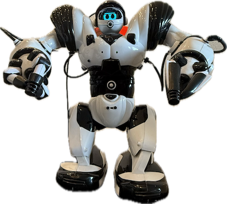

# Robot01

A ripped Robosapien LLM powered robot.  

- **Hardware**
	- Robosapien V1
	- Nvidia AGX Xavier (the brain)
	- Adafruit HUZZAH32 ESP32 Feather (Main board)
	- XIAO ESP32S3 Sense (camera/mic)
	- DFRobot MAX98357 (I2S Amplifier Module - 2.5W)
	- VL53L1X (Time of Flight Sensor)
	- BNO085 ( 9-DOF Orientation )
	- SSD_1306 - Led Screen I2C
	- Custom motor control board
		- MCP23017 ( input/output expander ) x 2
		- LD293D (Dual H-Bridge Motor Driver) x 4

- **Firmware**  
	Two ESP32 firmwares:
	- Main : body movement, display, sensors and speaker (udp streaming).
	- Sense : the camera and mic (udp streaming).

- **Backend software**
	Web interface & AI models
	- Backend Implemented on a Nvidia AGX Xavier development board
	- All models run locally (tts, stt, llm, Agentic)
	- Python based webserver (Flask) for Web interface and API

- **Frontend**
	- Simple HTML frontend based on PicoCSS and jQuery

## Intro

I am not a hardware guy, so the Hardware is really a mess. It just a bunch of sensors and other peripherals hooked up to two esp32 boards. Use it for inspiration not implementation.  

